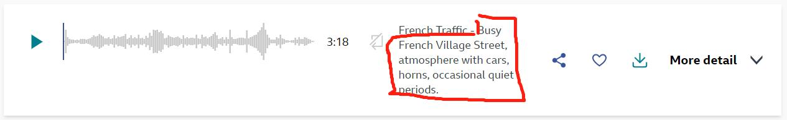

# BCC Sound effects Data Card
## Data Collection

|Source|Collecting Method|
|:---------:|:--------|
| [BBC website](https://sound-effects.bbcrewind.co.uk/search)  |1.Scrape from the [BBC website](https://sound-effects.bbcrewind.co.uk/search) and get the metadata <br>2. Download according to URLs provided in the metadata file, using a downloading script|

## Preprocessing Principles

You may refer to [freesonud_preprocess.py](/data_preprocess/preprocess_bbc.py) for all the details. 


#### 


      
```json
{
    "text": "Busy French Village Street, atmosphere with cars, horns, occasional quiet periods"
    }

```
### I. Json file generation principles 
-  **` text  entry`**  
    
    We take the title of the sound effect as the text entry, with class names removed (e.g. here we remove the class name "French-Traffic").
- **`tag  entry`** No such entry for this dataset 
- **`original_data  entry`** No such entry for this dataset 
### II. Audio filtering principles
1. Discard all audios failed to be read by `soundfile.read()` method or denied by FFmpeg while processing.
### III. Audio format specifications
After the preprocessing work, all audio files should be in FLAC format with sampling rate of 48KHZ. (Processed by ffmpeg).
