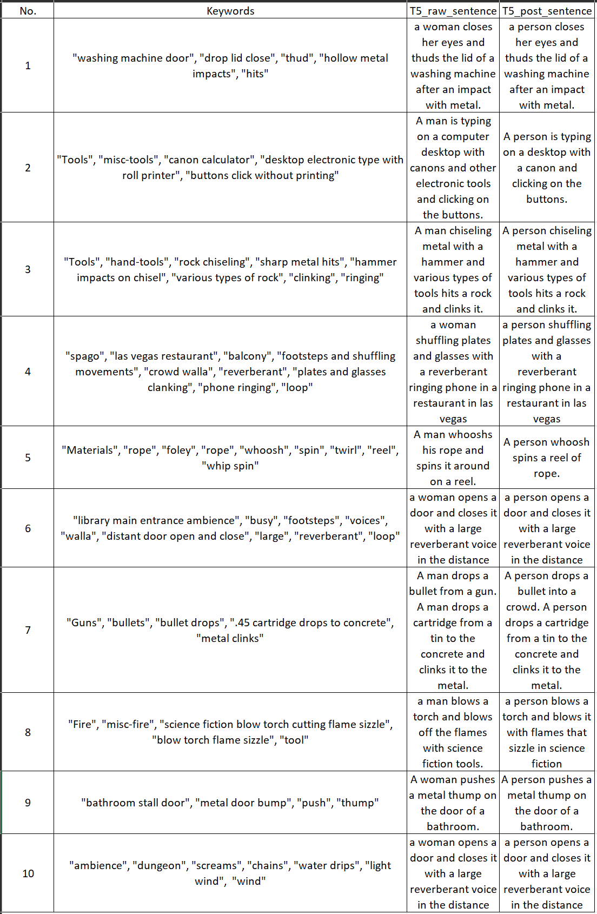

# Epidemic Sound Data Card
## Data Collection

|Source|Collecting Method|
|:---------:|:--------|
| [Epidemic Sound website](https://www.epidemicsound.com/sound-effects/)  |1.Scrape from the [Epidemic Sound website](https://www.epidemicsound.com/sound-effects/) and get the [metadata](/metadata/Epidemic_sound(sound_effects)) <br>2. Download according to URLs provided in the metadata file, using a downloading script|

## Preprocessing Principles

You may refer to [freesonud_Epidemic.py](/data_preprocess/preprocess_freesound.py) for all the details. Here is an audio-json pairs selected from the processed dataset:


```json

    "text": [
        "Wrestling Crowd",
        "the sounds of wrestling crowd, mezzanine level, huge crowd, p.a., and loop."
    ],
    "tag": [
        "Crowds",
        "applause",
        "wrestling crowd",
        "mezzanine level",
        "huge crowd",
        "p.a.",
        "loop"
    ],
    "original_data": {
        "title": "Wrestling Crowd",
        "id": 130586,
        "added": "2021-03-29T11:17:05",
        "length": 30.0,
        "bpm": 0.0,
        "isSfx": 1.0,
        "hasVocals": 0.0,
        "energyLevel": "medium",
        "genres": "applause",
        "url": "https://dkihjuum4jcjr.cloudfront.net/ES_ITUNES/Wrestling%20Crowd%205/ES_Wrestling%20Crowd%205.mp3",
        "metadataTags": [
            "wrestling crowd",
            "mezzanine level",
            "huge crowd",
            "p.a.",
            "loop"
        ],
        "Class_name": "Crowds"
    },
    "text_augment_t5": "p vs wrestling on the mezzanine with huge crowds a teddy bear in the midst of a storm a loop of tv shows on a computer.",
    "text_augment_all": [
        "Wrestling Crowd",
        "the sounds of wrestling crowd, mezzanine level, huge crowd, p.a., and loop.",
        "p vs wrestling on the mezzanine with huge crowds a teddy bear in the midst of a storm a loop of tv shows on a computer."
    ]
```


### I. Json file generation principles and keywords-to-caption data augmentation 
-  **` text  entry`** 
    1. Take the content of `original_data->title` entry in json file above, remove the potential digits and the end of the title (e.g. Wrestling Crowd 01 -> Wrestling Crowd) Let it be the first caption of the audio.
    2. Take the the content of `original_data->metadataTags` entry and merge them with `original_data->Class_name` and `original_data->genre`. Then use the formula `the sounds of {metadataTags}, {Class_name}, {genre}.` to generate the second caption of the audio. 

    As a result, the text entry eventually looks like  `"text": [processed title, made up caption]`. When training we will randomly choose one of them in the list to be the caption.

- **`tag  entry`** Take the the content of `original_data->metadataTags` entry and merge them with `original_data->Class_name` and `original_data->genre`.

- **`original_data  entry`** All information in metadata parquet file will be stored in this entry.
- **`text_augment_t5  entry`**  Take the keywords from `tag` entry in json file above, and we used a [pre-trained language model T5](https://github.com/gagan3012/keytotext) to make captions on top of these keywords. We also de-bias the output sentence as post-processing. For example, if the model generate a sentence containing "woman" or "man", we replace “woman” and “man” with ‘person’ as gender de-bias. Here are some examples of keyword-to-caption augmentation from AudioSet labels and the de-biased version for the model training:


Additionally, when applying keyword to caption, we excluded samples shorter than 2 seconds, as we found in such case the audio is merely a single event, thus matching poorly with the caption generated. When using keyword to caption in training dataset including audioset, we use only the captions generated by keyword to caption and exclude the captions generated by template.


### II. Audio filtering principles
1. Keep audios with sampling rate higher than **16KHZ** and discard the rest.
2. Discard all audios failed to be read by `soundfile.read()` method or denied by FFmpeg while processing.
### III. Audio format specifications
After the preprocessing work, all audio files should be in FLAC format with sampling rate of 48KHZ. (Processed by ffmpeg).
