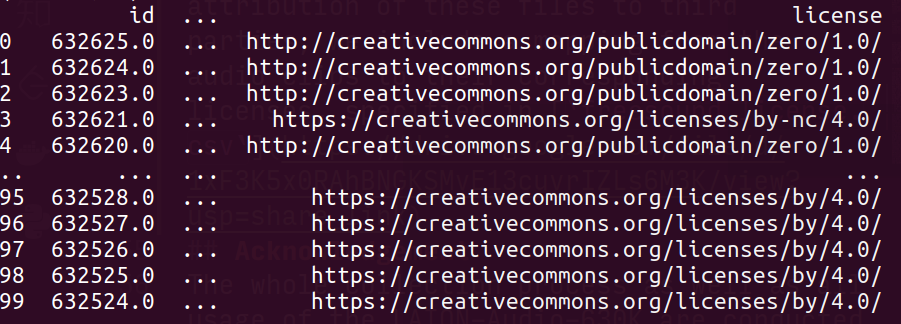

# LAION-Audio-630K Dataset
LAION-Audio-630K is a large-scale audio-text dataset consisting of 633,526 pairs with the total duration of 4,325.39 hours.  It contains audios of human activities, natural sounds and audio effects, consisting of 8 data sources (see the [*data source table*](#data-sources) below) from publicly available websites.  We collect these datasets by downloading audios and relevant text descriptions. Based on our current knowledge, LAION-Audio-630K is the largest audio-text dataset publicly available and a magnitude larger than previous audio-text datasets (by 2022-11-05).

## Content
Among the 8 datasets, we **only release 4 of them (BBC sound effects, Epidemic Sound, Audiostock and Freesound)**. The first 3 datasets are available under [csv format](#csv-format) , since they are public available by anyone through URL links provided by correspondent websites. As to Freesound, we released the whole dataset (audio files + text caption) to Hugging Face. However, as to the others, i.e. Free To Use Sounds, Sonniss Game Effects, We Sound Effects and Paramount Motion Sound Effects, we would not release them because they are pruchased by LAION. 

### CSV Format
CSV files are of the following structure:
  
  | url | caption1 | caption2 | ... | caption_t5 | {metadata1} | {metadata2} | ... | 
  | :--- | :--- | :--- | :--- | :--- | :--- | :--- | :--- |

- **url**: The URL of the audio file
- **caption_i**: the i-th caption of the audio file
- **caption_t5**: For Epidemic Sound, we adopted keywords-to-caption data augmentation using T5 model. Details could be found in the datacard of Epidemic Sound. 
- **{metadata_i}**: Metadata could be the freesound id of the audio etc. 

### Datacards
We provide a datacard for each dataset we processed, which record how we process it. If you want to learn more about caption generation as well as details of **keywords-to-caption data augmentation**, please read datacards available [here](/data_card/) (for Epidemic Sound dataset).    

### About Freesound
We provide two version of Freesound dataset.
- **Freesound (full)**: The original Freesound dataset. Details could be found in its datacard.
- **Freesound (no overlap)**: Made based on Freesound(full), with samples from ESC50, FSD50K, Urbansound8K and Clotho removed.

**We have released the processed freesound dataset in Webdataset format to a [Hugging Face repository](https://huggingface.co/datasets/Meranti/CLAP_freesound)**

## Data Sources
| Name                                             |Duration                 |Number of Samples   |Data Type                     | Source                                                                                                                                                                                                             | Data Card |                               
|--------------------------------------------------|-------------------------|--------------------|---------                     |--------------------------------------------------------------------------------------------------------------------------------------------------------------------------------------------------------------------|----------- |
| Freesound (no overlap)                           |2817.31hrs               | 460801             |1-2 captions per audio, audio    | [website](https://freesound.org/)   [**licenses file**](https://drive.google.com/file/d/1xF3K5x0RAhBNGKSMvE13cuvrIZLs6M3K/view?usp=share_link)   [Hugging Face repository](https://huggingface.co/datasets/Meranti/CLAP_freesound)|
| Freesound (full)                                 |3033.38hrs               | 515581             |1-2 captions per audio, audio    | [website](https://freesound.org/)   [**licenses file**](https://drive.google.com/file/d/1xF3K5x0RAhBNGKSMvE13cuvrIZLs6M3K/view?usp=share_link) [Hugging Face repository](https://huggingface.co/datasets/Meranti/CLAP_freesound)                                                 |[data card](/data_card/freesound.md)|
| Epidemic Sound                                   |220.41hrs                | 75645              |2 captions per audio, audio    | [website](https://www.epidemicsound.com/sound-effects/)   [csv (Including T5-generated de-biased captions)](https://drive.google.com/file/d/1vo0NslkCTJHI03FbBSHLRztP6v2XkYNW/view?usp=sharing)                                |[data card](/data_card/Epidemic_sound.md)           |     
| Audiostock                                       |453.36hrs                 | 10000              |1 caption per audio, audio    | [website](https://audiostock.net/se)   [csv](https://drive.google.com/file/d/1FnOcrb6fREIDBzB2lknJnszVn-yNCPp6/view?usp=sharing)                                                           |[data card](/data_card/Audiostock.md) |
| Audiostock (raw)                                 |11305.42hrs               | 251618             |1 caption per audio, audio    | [website](https://audiostock.net/se)   [csv](https://drive.google.com/file/d/1bkl6gOGqECJ93YmAcTGIcewxqSGIV6aO/view?usp=sharing)                                                           |[data card](/data_card/Audiostock.md) |             
| BBC Sound Effects                                |463.48hrs                | 15973              |1 caption per audio, audio    | [website](https://sound-effects.bbcrewind.co.uk/)   [csv*(no longer available, click to see explication below)](#about-bbc-sound-effects)                                                                                                                                |[data card](/data_card/BBC.md)| 
| Free To Use Sounds                               |175.73hrs                | 6370               |Filename as caption, audio    | [website(need purchasing)](https://www.freetousesounds.com/product/all-in-one-sound-library-bundle/)                                                                                          |                                  | 
| Sonniss Game effects                             |84.6hrs                  | 5049               |Filename as caption, audio    | [website(need purchasing)](https://sonniss.com/gameaudiogdc/)                                                                                                                                 |                                  | 
| We Sound Effects                                 |12.00hrs                 | 488                |Filename as caption, audio    | [website(need purchasing)](https://www.wesoundeffects.com/)                                                                                                                                   |                                  | 
| Paramount Motion Sound Effects                   |19.49hrs                 | 4420               |Filename as caption, audio    | [website(need purchasing)](https://www.paramountmotion.com/odeon-sound-effects)                                                                                                               |                                  | 

#### *About BBC Sound Effects
Recently, BBC sound effects have modified their website structure. In consequence, only 300 samples are available for download. So, unfortunately, we are no longer able to generate csv file using our old scripts. In the meantime, many scrappers exist on GitHub, such as https://github.com/alisomay/bbc-sound-effects-downloader. You may try them to see if they work.

## Keyword-to-Caption Augmentation
We employ the keyword-to-caption model to augment labels of AudioSet and Epidemic Sound into corresponding captions with aid of a pre-trained language model T5. We also de-bias these captions by replacing, for example, "woman" and "man" with "person", aiming to eliminate potential gender discrimination. We hereby release the augmented captions for Epidemic Sound and AudioSet (in csv format).

| Epidemic Sound | AudioSet |
|----------------|----------|
|[Epidemic_all_debiased.csv](https://drive.google.com/file/d/1vo0NslkCTJHI03FbBSHLRztP6v2XkYNW/view?usp=sharing) | [csv files for AudioSet balanced_train, unbalanced_train, and eval splits](https://drive.google.com/drive/folders/1Ip5Eh_Mb7Ye09ZpqKA-dTIdh4SgFDSnB?usp=sharing) |
## Credits & Licence
- **!!!TERM OF USE!!!**: **By downloading audios through the links provided in the csv files, you agree that you will use the audios for research purposes only, unless you get the permission from owners of the Datasource that you can use it for other purposes.**
<!-- ### Freesound Credit: 
All audio clips from Freesound are released under Creative Commons (CC) licenses, while each clip has its own license as defined by the clip uploader in Freesound, some of them requiring attribution to their original authors and some forbidding further commercial reuse. Specifically, here is the statistics about licenses of audio clips involved in LAION-Audio-630K:
- CC-BY:  196884
- CC-BY-NC:  63693
- CC0:  270843
- CC Sampling+:  11556

For attribution purposes and to facilitate attribution of these files to third parties, we include a mapping from the audio clips to their corresponding licenses, specified in [**`freesound_license.csv`**](https://drive.google.com/file/d/1xF3K5x0RAhBNGKSMvE13cuvrIZLs6M3K/view?usp=share_link)(size : about 240 MB). Please note that for each audio clip, the uploader's freesound username is also included in the csv file.
 -->

<!-- #### Usage of Freesound clips in LAION-Audio-630K for commercial purposes

We would like to restate that **only academic uses** are allowed for LAION-Audio-630K. If you want to use Freesound clips in LAION-Audio-630K for commercial purposes, please contact Frederic Font Corbera at frederic.font@upf.edu. -->
## Acknowledgement
The whole collection process as well as all usage of the LAION-Audio-630K are conducted by Germany non-profit pure research organization [LAION](https://laion.ai/). All contributors and collectors of the dataset are considered as open source contributors affiliated to LAION. These community contributors (Discord ids) include but not limited to: @marianna13#7139, @Chr0my#0173, @PiEquals4#1909, @Yuchen Hui#8574, @Antoniooooo#4758, @IYWO#9072, krishna#1648, @dicknascarsixtynine#3885, and @turian#1607. We would like to appreciate all of them for their efforts on the LAION-Audio-630k dataset. 
